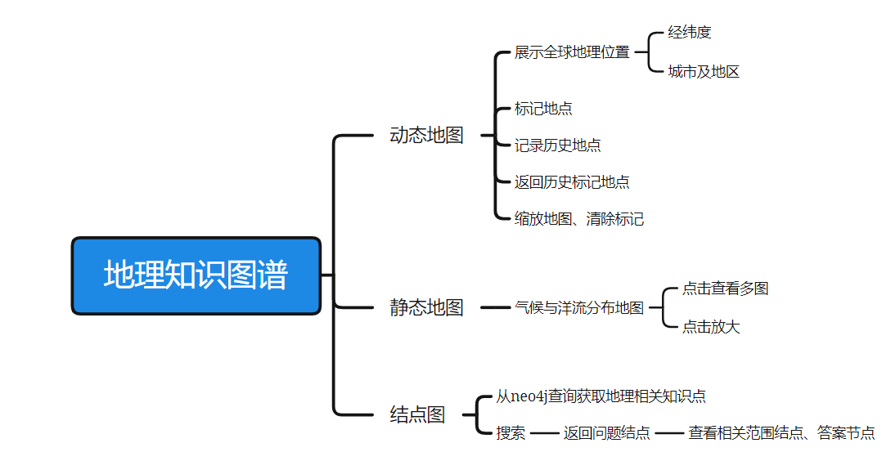
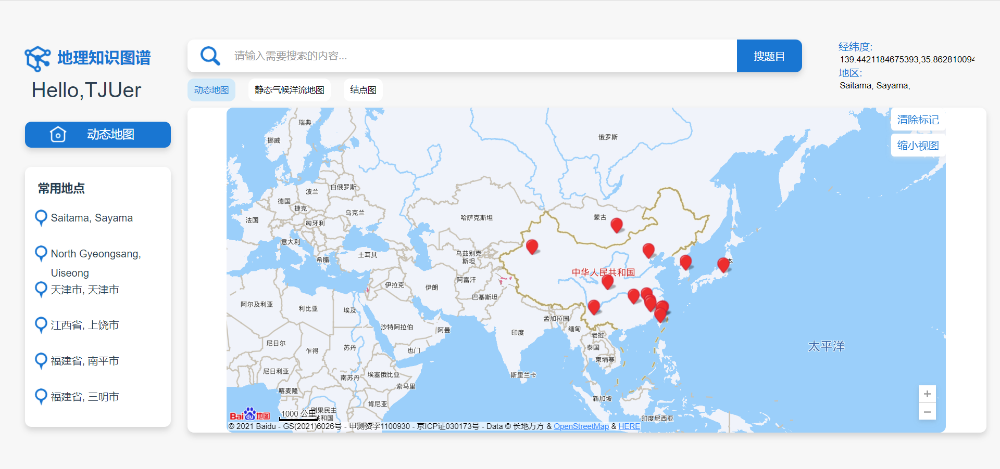
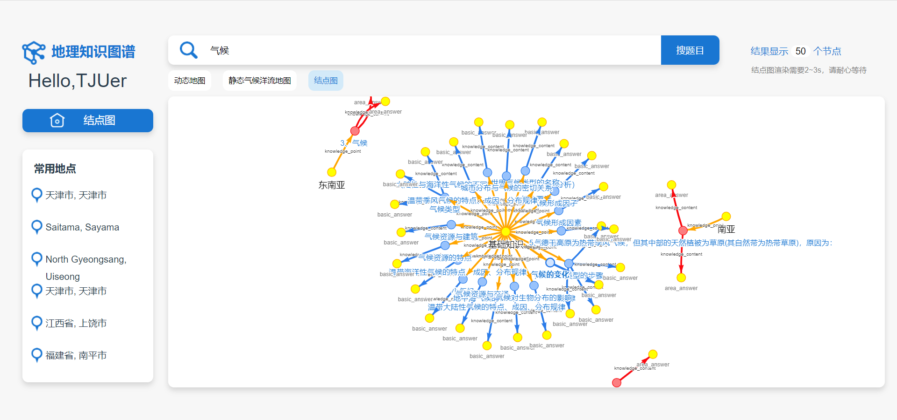
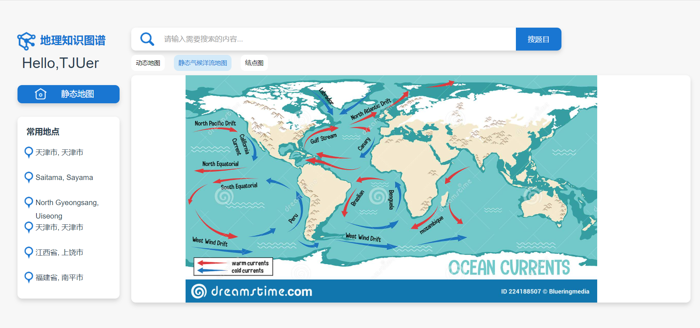
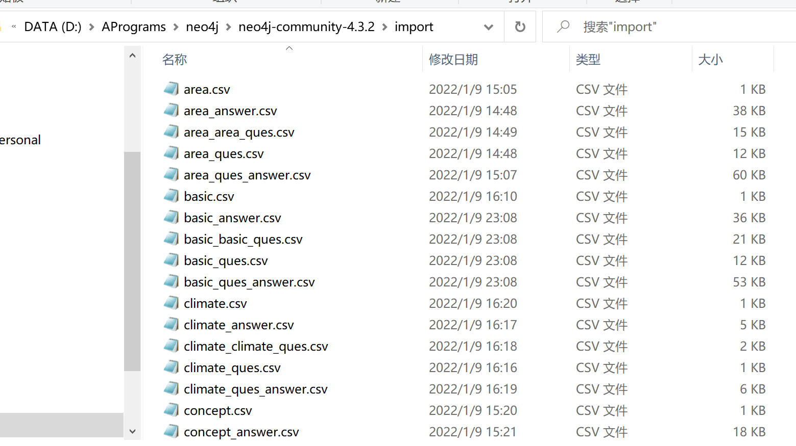
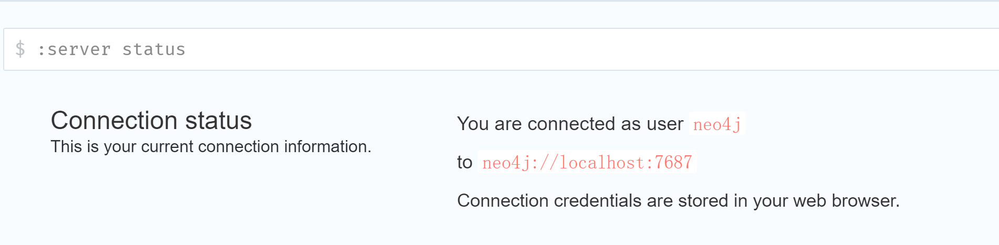
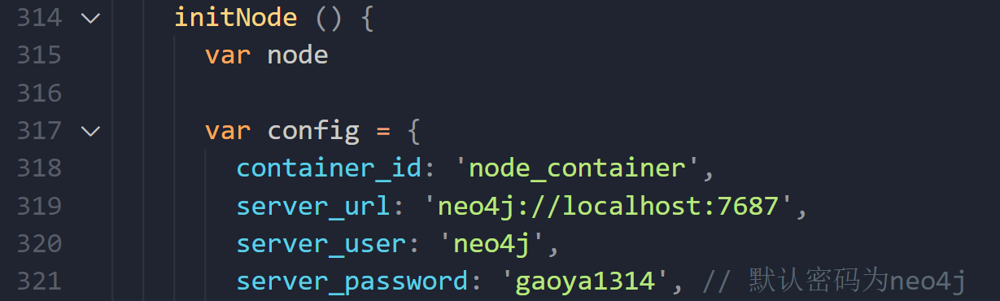

## 效果展示









## 数据爬取

- 爬虫脚本 `get_data.ipynb`
- 文本转csv脚本 `txt2csv.py`

```
python依赖
使用pip安装
urllib3== 1.26.7
lxml== 4.7.1
```

## 前端构建

- 工程文件目录(没系统学过前端 写的比较拉 vue功能也没用好 莫见怪)


- 前端html元素和js函数全写在 `App.vue`中
- 写UI使用了Element UI （https://element.eleme.io/#/zh-CN/component/installation）
- 动态地图使用百度地图API

  官方文档（https://lbs.baidu.com/index.php?title=jspopularGL/guide/show）

  实际参考博客（https://blog.csdn.net/qq_42957741/article/details/117982908）
- 链接neo4j数据库实现结点图查询使用开源项目neovis.js

  github网址（https://github.com/neo4j-contrib/neovis.js）

  参考博客（https://blog.csdn.net/weixin_44178880/article/details/108315437）

```
依赖安装
npm i element-ui -S
npm install --save neovis.js
```

## 数据导入

- 将所有.csv文件复制到neo4j安装文件路径下import文件夹
- 将所有 `*_import.txt`中的语句复制在neo4j命令行中执行

  

## 项目运行

```
启动数据库
neo4j console
启动前端
npm run dev
```

本地配置neo4j数据库需根据具体情况修改配置（文件 `App.vue 317行`）




